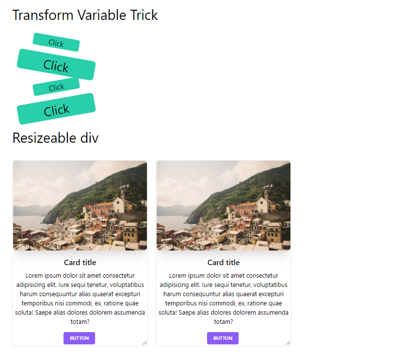
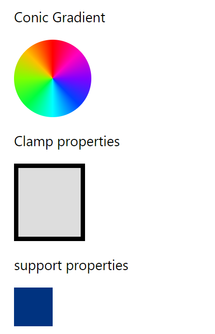

# CSS Tips & Tricks

There are so many css tips and trics that we dont know. So i have tried to find out those trics and practiced.

## Demo

https://shajal-kumer.github.io/css-tips-and-tricks/

## Lessons Learned

-   transform variable trick
-   resizeable div
-   aspect ratio
-   calc function - unit conversion
-   css tooltip
-   :is selector
-   counter
-   conic gradient
-   clamp property
-   support property
-   writing mode property
-   smooth scroll and scroll-padding-top property
-   pointer-event
-   block vs inline
-   selection first letter
-   Invert the color on the screen
-   Adapt text on resize
-   Double shadow
-   Text Gradient

## Screenshots

## Tech Stack

**Client:** HTML, CSS

## 🚀 About Me

I'm a front-end developer with backend knowledge.

## 🛠 Skills

**Front-end** : Javascript, React, HTML, CSS, Bootstrap, Tailwind, SASS, SVG, GSAP

**Aditional Backend** : Node.js, Express.js, MongoDB, MySQL

## Acknowledgements

-   [Top 10 CSS Tricks You Didn't Know!](https://www.youtube.com/watch?v=CxC925yUxSI)
-   [5 More Must Know CSS Tricks That Almost Nobody Knows](https://www.youtube.com/watch?v=pKO1ktPQByk)
